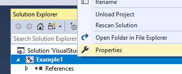
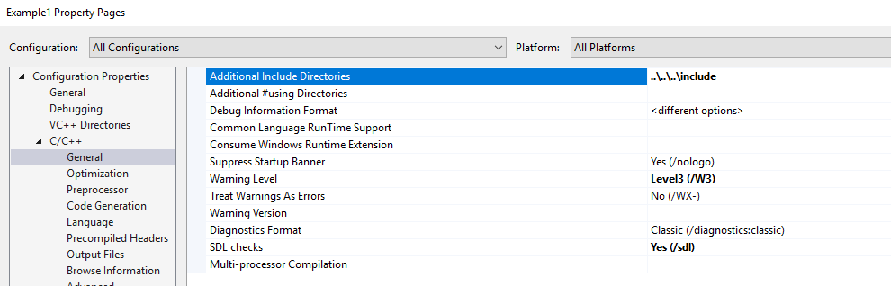
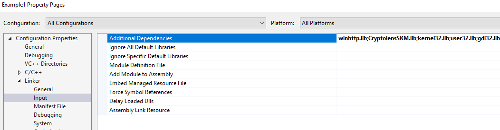

# Windows support with Visual Studio

It is fairly simple to get started with SKM Client API for C++ on Windows. 

> Note: this version of the library is specifically built for Windows since it uses native Windows call.

## Getting the library

### Building the library yourself

Instructions for building the library and creating *CryptolensSKM.lib* using Visual Studio:

  1. Open the *CryptolensSKM.sln* solution file.
  1. Select the desired platform and configuration in the Visual Studio GUI
  1. Build the solution (Build -> Solution).
  1. *CryptolensSKM.lib* can now be found in the *Output\\\<Platform\>\\\<Configuration\>* directory.

### Using in your own project

For using the library in your own Visual Studio projects two things needs to be
done. Firstly, Visual Studio needs to be told to use include files from the
*SKM-Client-API-CPP\include* directory, and secondly, the linker in Visual Studio
needs to be set up to link against CryptolensSKM.lib.

An example project can be found in *SKM-Client-API-CPP\example\Visual Studio\Example1*.
This project is set up to work with the *CryptolensSKM.sln* file, i.e. it looks for
*CryptolensSKM.lib* in *SKM-Client-API-CPP\Output\\\<Platform\>\\\<Configuration\>*.

### Setting up include directories

  1. Right-click on the project in in Visual Studio and select Properties.

     
  1. The path to *SKM-Client-API-CPP\include* needs to be added under *Configuration Properties ->
     C\C++ -> General -> Additional Include Directories*.

     Thus if the SKM-Client-API-CPP git repository was cloned at
     ```
     C:\Users\<user>\Documents\Visual Studio 2017\Projects\SKM-Client-API-CPP
     ```
     this path would be added under *Additional Include Directories*.

     Alternatively, a relative path can be used as in the Example1 project:


<!---->

### Setting up the linker

  1. Right-click on the project in Visual Studio and select Properties.
  1. Under *Configuration Properties -> Linker -> Input -> Additional Dependencies*
     we need to add "winhttp.lib;CryptolensSKM.lib" to the existing list of
     dependencies.

     I.e. if this field already contains the value
     ```
     kernel32.lib;%(AdditionalDependencies)
     ```
     the new value would be:
     ```
     winhttp.lib;CryptolensSKM.lib;kernel32.lib;%(AdditionalDependencies)
     ```

     The settings should thus look something like the following:

<!---->

  1. Under *Configuration Properties -> Linker -> General -> Additional Library
     Directories* we need to add the directory containing *CryptolensSKM.lib*.

     If we cloned the github repository at
     ```
     C:\Users\<user>\Documents\Visual Studio 2017\Projects\SKM-Client-API-CPP
     ```
     and we built the library as described above, then we would add
     ```
     C:\Users\<user>\Documents\Visual Studio 2017\Projects\SKM-Client-API-CPP\vsprojects\Output\$(Platform)\$(Configuration)\
     ```
     to the *Additional Library Directories*, assuming your project uses the default
     Release/Debug configurations in Visual Studio.

     The Example1 project uses the following relative path, which also works:


<!---->
